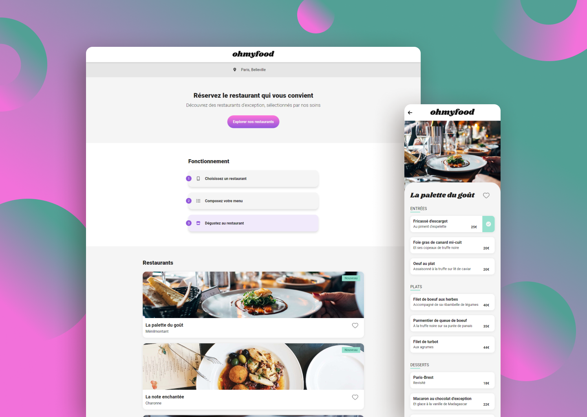

  

    <h1>Ohmyfood</h1>
     
    
A multi-pages website to reserve places in differents restaurants

    <h3><a href="https://ohmyfood-cem.netlify.app/">🔗 Link to the Website</a></h2>
    
  

## Built with

## Features

- Multi-pages website
- Advanced animations and transitions
- Use of Flexbox and Grid
- Responsive and classic design

## Context of the Project

I built this website to validate my training at Openclassrooms
